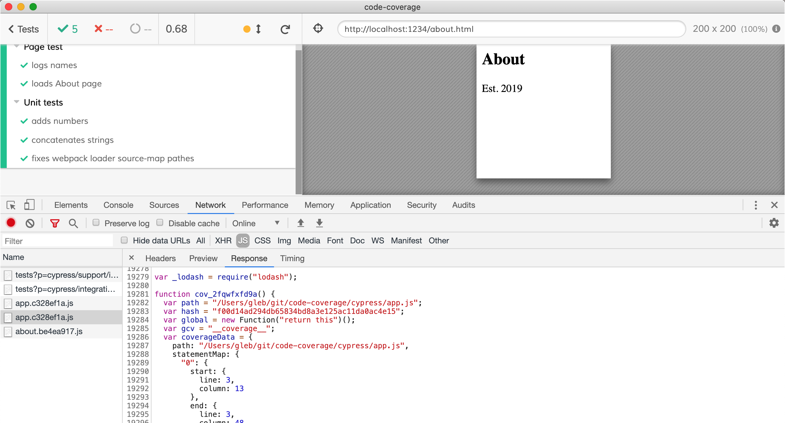
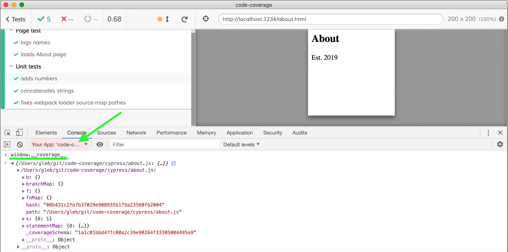
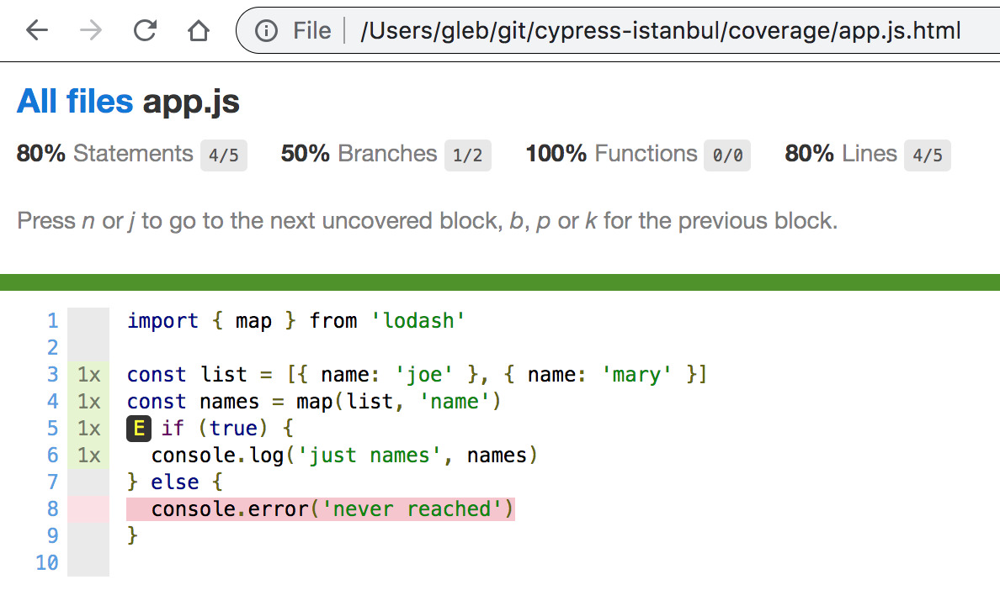
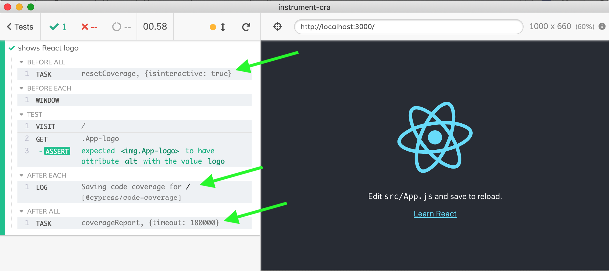
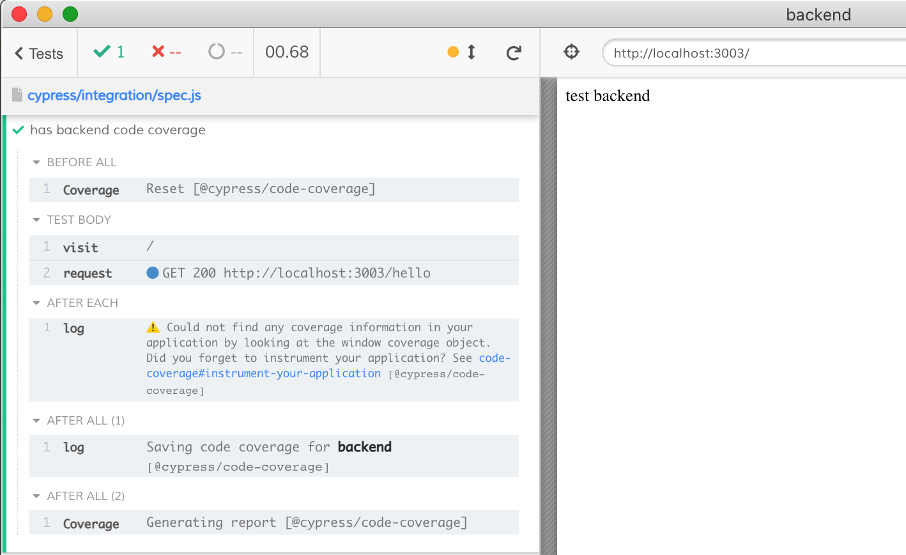

# @cypress/code-coverage [![renovate-app badge][renovate-badge]][renovate-app] [](https://circleci.com/gh/cypress-io/code-coverage)

> Saves the code coverage collected during Cypress tests

## Install

```shell
npm install -D @cypress/code-coverage
```

Note: this plugin assumes `cypress` is a peer dependency already installed in your project.

Add to your `cypress/support/index.js` file

```js
import '@cypress/code-coverage/support'
```

Register tasks in your `cypress/plugins/index.js` file

```js
module.exports = (on, config) => {
  require('@cypress/code-coverage/task')(on, config)

  // add other tasks to be registered here

  // IMPORTANT to return the config object
  // with the any changed environment variables
  return config
}
```

## Instrument your application

This plugin **DOES NOT** instrument your code. You have to instrument it yourself using [Istanbul.js](https://istanbul.js.org/) tool. Luckily it is not difficult. For example, if you are already using Babel to transpile you can add [babel-plugin-istanbul](https://github.com/istanbuljs/babel-plugin-istanbul) to your `.babelrc` and instrument on the fly.

```
{
  "plugins": ["istanbul"]
}
```

Please see the [Examples](#examples) section down below, you can probably find a linked project matching your situation to see how to instrument your application's source code before running end-to-end tests to get the code coverage.

If your application has been instrumented correctly, then you should see additional counters and instructions in the application's JavaScript resources, like the image down below shows.



You should see the `window.__coverage__` object in the "Application under test iframe"



If you have instrumented your application's code and see the `window.__coverage__` object, then this plugin will save the coverage into `.nyc_output` folder and will generate reports after the tests finish (even in the interactive mode). Find the LCOV and HTML report in the `coverage/lcov-report` folder.



That should be it! You should see messages from this plugin in the Cypress Command Log



### More information

- Read [Cypress Code Coverage: Instrumenting code](https://on.cypress.io/code-coverage#Instrumenting-code) guide
- Watch [Code coverage](https://youtu.be/C8g5X4vCZJA) webinar
- Watch videos in [Cypress Tips & Tricks](https://www.youtube.com/playlist?list=PLP9o9QNnQuAYYRpJzDNWpeuOVTwxmIxcI) that deal with code coverage

### App vs unit tests

You need to instrument your web application. This means that when the test does `cy.visit('localhost:3000')` any code the `index.html` requests should be instrumented by YOU. See [Examples](#examples) section for advice, usually you need to stick `babel-plugin-istanbul` into your pipeline somewhere.

If you are testing individual functions from your application code by importing them directly into Cypress spec files, this is called "unit tests" and Cypress can instrument this scenario for you. See [Instrument unit tests](#instrument-unit-tests) section.

## Reports

The `coverage` folder has results in several formats, and the coverage raw data is stored in `.nyc_output` folder. You can see the coverage numbers yourself. This plugin has `nyc` as a dependency, so it should be available right away. Here are common examples:

```shell
# see just the coverage summary
$ npx nyc report --reporter=text-summary
# see just the coverage file by file
$ npx nyc report --reporter=text
# save the HTML report again
$ npx nyc report --reporter=lcov
```

It is useful to enforce [minimum coverage](https://github.com/istanbuljs/nyc#common-configuration-options) numbers. For example:

```shell
$ npx nyc report --check-coverage --lines 80
----------|---------|----------|---------|---------|-------------------
File      | % Stmts | % Branch | % Funcs | % Lines | Uncovered Line #s
----------|---------|----------|---------|---------|-------------------
All files |     100 |      100 |     100 |     100 |
 main.js  |     100 |      100 |     100 |     100 |
----------|---------|----------|---------|---------|-------------------

$ npx nyc report --check-coverage --lines 101
----------|---------|----------|---------|---------|-------------------
File      | % Stmts | % Branch | % Funcs | % Lines | Uncovered Line #s
----------|---------|----------|---------|---------|-------------------
All files |     100 |      100 |     100 |     100 |
 main.js  |     100 |      100 |     100 |     100 |
----------|---------|----------|---------|---------|-------------------
ERROR: Coverage for lines (100%) does not meet global threshold (101%)
```

Watch video [How to read code coverage report](https://youtu.be/yVvCYtsmkZU) to see how to read the HTML coverage report.

## Instrument unit tests

If you test your application code directly from `specs` you might want to instrument them and combine unit test code coverage with any end-to-end code coverage (from iframe). You can easily instrument spec files using [babel-plugin-istanbul](https://github.com/istanbuljs/babel-plugin-istanbul) for example.

Install the plugin

```
npm i -D babel-plugin-istanbul
```

Set your `.babelrc` file

```rc
{
  "plugins": ["istanbul"]
}
```

Put the following in `cypress/plugins/index.js` file to use `.babelrc` file

```js
module.exports = (on, config) => {
  require('@cypress/code-coverage/task')(on, config)
  on('file:preprocessor', require('@cypress/code-coverage/use-babelrc'))
  return config
}
```

Now the code coverage from spec files will be combined with end-to-end coverage.

Find example of a just the unit tests and JavaScript source files with collected code coverage in [examples/unit-tests-js](./examples/unit-tests-js).

### Alternative for unit tests

If you cannot use `.babelrc` for some reason (maybe it is used by other tools?), try using the Browserify transformer included with this module in `use-browserify-istanbul` file.

```js
module.exports = (on, config) => {
  require('@cypress/code-coverage/task')(on, config)
  on(
    'file:preprocessor',
    require('@cypress/code-coverage/use-browserify-istanbul')
  )
  return config
}
```

## Instrument backend code

Example in [examples/backend](examples/backend) folder.

You can also instrument your server-side code and produce combined coverage report that covers both the backend and frontend code

1. Run the server code with instrumentation. The simplest way is to use [nyc](https://github.com/istanbuljs/nyc). If normally you run `node src/server` then to run instrumented version you can do `nyc --silent node src/server`.
2. Add an endpoint that returns collected coverage. If you are using Express, you can simply do

```js
const express = require('express')
const app = express()
require('@cypress/code-coverage/middleware/express')(app)
```

**Tip:** you can register the endpoint only if there is global code coverage object, and you can exclude the middleware code from the coverage numbers

```js
// https://github.com/gotwarlost/istanbul/blob/master/ignoring-code-for-coverage.md
/* istanbul ignore next */
if (global.__coverage__) {
  require('@cypress/code-coverage/middleware/express')(app)
}
```

If you use Hapi server, define the endpoint yourself and return the object

```js
if (global.__coverage__) {
  require('@cypress/code-coverage/middleware/hapi')(server)
}
```

For any other server, define the endpoint yourself and return the coverage object:

```js
if (global.__coverage__) {
  // add method "GET /__coverage__" and response with JSON
  onRequest = (response) => response.sendJSON({ coverage: global.__coverage__ })
}
```

3. Save the API coverage endpoint in `cypress.json` file to let the plugin know where to call to receive the code coverage data from the server. Place it in `env.codeCoverage` object:

```json
{
  "env": {
    "codeCoverage": {
      "url": "http://localhost:3000/__coverage__"
    }
  }
}
```

That should be enough - the code coverage from the server will be requested at the end of the test run and merged with the client-side code coverage, producing a combined report.

### expectBackendCoverageOnly

If there is NO frontend code coverage, and you want to only collect the backend code coverage using Cypress tests, set `expectBackendCoverageOnly: true` in `cypress.json` file. Otherwise Cypress complains that it cannot find the frontend code coverage.

Default:



After:

```json
{
  "env": {
    "codeCoverage": {
      "url": "http://localhost:3003/__coverage__",
      "expectBackendCoverageOnly": true
    }
  }
}
```


## Custom report folder

You can specify custom report folder by adding `nyc` object to the `package.json` file. For example to save reports to `cypress-coverage` folder, use:

```json
{
  "nyc": {
    "report-dir": "cypress-coverage"
  }
}
```

## Custom reporters

You can specify custom coverage reporter(s) to use. For example to output text summary and save JSON report in `cypress-coverage` folder set in your `package.json` folder:

```json
{
  "nyc": {
    "report-dir": "cypress-coverage",
    "reporter": ["text", "json"]
  }
}
```

**Tip:** find list of reporters [here](https://istanbul.js.org/docs/advanced/alternative-reporters/)

## Custom NYC command

Sometimes NYC tool might be installed in a different folder not in the current or parent folder, or you might want to customize the report command. In that case, put the custom command into `package.json` in the current folder and this plugin will automatically use it.

```json
{
  "scripts": {
    "coverage:report": "call NYC report ..."
  }
}
```

## TypeScript users

TypeScript source files should be automatically included in the report, if they are instrumented.

See [examples/ts-example](examples/ts-example), [bahmutov/cra-ts-code-coverage-example](https://github.com/bahmutov/cra-ts-code-coverage-example) or [bahmutov/cypress-angular-coverage-example](https://github.com/bahmutov/cypress-angular-coverage-example).

## Include code

By default, the code coverage report includes _only_ the instrumented files loaded by the application during the tests. If some modules are loaded dynamically, or are loaded by the pages NOT visited during any tests, these files are not going to be in the report - because the plugin does not know about them. You can include all expected source files in the report by using `include` list in the `package.json` file. The files without counters will have 0 percent code coverage.

For example, if you want to make sure the final report includes all JS files from the "src/pages" folder, set the "nyc" object in your `package.json` file.

```json
{
  "nyc": {
    "all": true,
    "include": "src/pages/*.js"
  }
}
```

See example [examples/all-files](./examples/all-files)

## Exclude code

You can exclude parts of the code or entire files from the code coverage report. See [Istanbul guide](https://github.com/gotwarlost/istanbul/blob/master/ignoring-code-for-coverage.md). Common cases:

### Exclude "else" branch

When running code only during Cypress tests, the "else" branch will never be hit. Thus we should exclude it from the branch coverage computation:

```js
// expose "store" reference during tests
/* istanbul ignore else */
if (window.Cypress) {
  window.store = store
}
```

### Exclude next logical statement

Often needed to skip a statement

```js
/* istanbul ignore next */
if (global.__coverage__) {
  require('@cypress/code-coverage/middleware/express')(app)
}
```

Or a particular `switch` case

```js
switch (foo) {
  case 1 /* some code */:
    break
  /* istanbul ignore next */
  case 2: // really difficult to hit from tests
    someCode()
}
```

### Exclude files and folders

See [`nyc` configuration](https://github.com/istanbuljs/nyc#common-configuration-options) and [ include and exclude options](https://github.com/istanbuljs/nyc#using-include-and-exclude-arrays). You can include and exclude files using `minimatch` patterns in `.nycrc` file or using "nyc" object inside your `package.json` file.

For example, if you want to only include files in the `app` folder, but exclude `app/util.js` file, you can set in your `package.json`

```json
{
  "nyc": {
    "include": ["app/**/*.js"],
    "exclude": ["app/util.js"]
  }
}
```

**Note:** if you have `all: true` NYC option set, this plugin will check the produced `.nyc_output/out.json` before generating the final report. If the `out.json` file does not have information for some files that should be there according to `include` list, then an empty placeholder will be included, see [PR 208](https://github.com/cypress-io/code-coverage/pull/208).

Another important option is `excludeAfterRemap`. By default it is false, which might let excluded files through. If you are excluding the files, and the instrumenter does not respect the `nyc.exclude` setting, then add `excludeAfterRemap: true` to tell `nyc report` to exclude files. See [examples/exclude-files](examples/exclude-files).

## Disable plugin

You can skip the client-side code coverage hooks by setting the environment variable `coverage` to `false`.

```shell
# tell Cypress to set environment variable "coverage" to false
cypress run --env coverage=false
# or pass the environment variable
CYPRESS_coverage=false cypress run
```

or set it to `false` in the `cypress.json` file

```json
{
  "env": {
    "coverage": false
  }
}
```

See [Cypress environment variables](https://on.cypress.io/environment-variables) and [support.js](support.js). You can try running without code coverage in this project yourself

```shell
# run with code coverage
npm run dev
# disable code coverage
npm run dev:no:coverage
```

## Links

- Read the [Cypress code coverage guide](http://on.cypress.io/code-coverage)
- Read ["Code Coverage by Parcel Bundler"](https://glebbahmutov.com/blog/code-coverage-by-parcel/) blog post
- Read ["Combined End-to-end and Unit Test Coverage"](https://glebbahmutov.com/blog/combined-end-to-end-and-unit-test-coverage/)
- If you are using React, check out [@cypress/instrument-cra](https://github.com/cypress-io/instrument-cra)
- Watch videos in [Cypress Tips & Tricks](https://www.youtube.com/playlist?list=PLP9o9QNnQuAYYRpJzDNWpeuOVTwxmIxcI) playlist

## Examples

### Internal examples

Full examples we use for testing in this repository:

- [examples/backend](examples/backend) only instruments the backend Node server and saves the coverage report
- [examples/fullstack](examples/fullstack) instruments and merges backend, e2e and unit test coverage into a single report
- [examples/before-all-visit](examples/before-all-visit) checks if code coverage works when `cy.visit` is made once in the `before` hook
- [examples/before-each-visit](examples/before-each-visit) checks if code coverage correctly keeps track of code when doing `cy.visit` before each test
- [examples/one-spec.js](examples/one-spec.js) confirms that coverage is collected and filtered correctly if the user only executes a single Cypress test
- [examples/ts-example](examples/ts-example) uses Babel + Parcel to instrument and serve TypeScript file
- [examples/use-webpack](examples/use-webpack) shows Webpack build with source maps and Babel
- [examples/unit-tests-js](examples/unit-tests-js) runs just the unit tests and reports code coverage (JavaScript source code)
- [examples/unit-tests-ts](examples/unit-tests-ts) **NOT WORKING** runs just the unit tests and reports code coverage (TypeScript source code)

### External examples

Look up the list of examples under GitHub topic [cypress-code-coverage-example](https://github.com/topics/cypress-code-coverage-example)

- [cypress-io/cypress-realworld-app](https://github.com/cypress-io/cypress-realworld-app) is an easy to setup and run real-world application with E2E, API, and unit tests that achieves 100% code-coverage for both front and back end code. Its CI pipeline also reports code-coverage reports across parallelized test runs to [Codecov](https://codecov.io/gh/cypress-io/cypress-realworld-app).
- [cypress-io/cypress-example-todomvc-redux](https://github.com/cypress-io/cypress-example-todomvc-redux) is a React / Redux application with 100% code coverage.
- [cypress-io/cypress-example-conduit-app](https://github.com/cypress-io/cypress-example-conduit-app) shows how to collect the coverage information from both back and front end code and merge it into a single report. The E2E test step runs in parallel in several CI containers, each saving just partial test coverage information. Then a merge job runs taking artifacts and combining coverage into the final report to be sent to an exteral coverage as a service app.
- [bahmutov/code-coverage-webpack-dev-server](https://github.com/bahmutov/code-coverage-webpack-dev-server) shows how to collect code coverage from an application that uses webpack-dev-server.
- [bahmutov/code-coverage-vue-example](https://github.com/bahmutov/code-coverage-vue-example) collects code coverage for Vue.js single file components.
- [lluia/cypress-typescript-coverage-example](https://github.com/lluia/cypress-typescript-coverage-example) shows coverage for React App that uses TypeScript. See discussion in issue [#19](https://github.com/cypress-io/code-coverage/issues/19).
- [bahmutov/cypress-and-jest](https://github.com/bahmutov/cypress-and-jest) shows how to run Jest unit tests and Cypress unit tests, collecting code coverage from both test runners, and then produce merged report.
- [rootstrap/react-redux-base](https://github.com/rootstrap/react-redux-base) shows an example with a realistic Webpack config. Instruments the source code using `babel-plugin-istanbul` during tests.
- [bahmutov/cypress-angular-coverage-example](https://github.com/bahmutov/cypress-angular-coverage-example) forked from [skylock/cypress-angular-coverage-example](https://github.com/skylock/cypress-angular-coverage-example) shows Angular 8 + TypeScript application with instrumentation done using [istanbul-instrumenter-loader](https://github.com/webpack-contrib/istanbul-instrumenter-loader).
- [bahmutov/testing-react](https://github.com/bahmutov/testing-react) shows how to get code coverage for a React application created using [CRA v3](https://github.com/facebook/create-react-app) without ejecting `react-scripts`.
- [bahmutov/cra-ts-code-coverage-example](https://github.com/bahmutov/cra-ts-code-coverage-example) instruments TypeScript React application on the fly without ejecting `react-scripts` by using [@cypress/instrument-cra](https://github.com/cypress-io/instrument-cra).
- [bahmutov/next-and-cypress-example](https://github.com/bahmutov/next-and-cypress-example) shows how to get backend and frontend coverage for a [Next.js](https://nextjs.org) project. Uses [middleware/nextjs.js](middleware/nextjs.js).
- [kylemh/next-ts-with-cypress-coverage](https://github.com/kylemh/next-ts-with-cypress-coverage) this example project contains Next.js with TypeScript, instrumented coverage reporting, @testing-library/react, and instructions on how to type custom commands.
- [akoidan/vue-webpack-typescript](https://github.com/akoidan/vue-webpack-typescript) Pure webpack config with vue + typescript with codecov reports. This setup uses babel-loader with TS checker as a separate thread.
- [bahmutov/code-coverage-subfolder-example](https://github.com/bahmutov/code-coverage-subfolder-example) shows how to instrument `app` folder using `nyc instrument` as a separate step before running E2E tests
- [bahmutov/docker-with-cypress-included-code-coverage-example](https://github.com/bahmutov/docker-with-cypress-included-code-coverage-example) runs tests inside pre-installed Cypress using [cypress/included:x.y.z](https://github.com/cypress-io/cypress-docker-images/tree/master/included) Docker image and reports code coverage.
- [bahmutov/app-in-docker-coverage-example](https://github.com/bahmutov/app-in-docker-coverage-example) shows an app running inside a Docker container, while Cypress runs on the local machine. Cypress can still [discover the source files](https://github.com/cypress-io/code-coverage/pull/197) before generating the report.
- [bahmutov/gatsby-cypress-with-code-coverage](https://github.com/bahmutov/gatsby-cypress-with-code-coverage) shows code coverage using the official Gatsby "Hello World" starter.
- [muratkeremozcan/angular-playground](https://github.com/muratkeremozcan/angular-playground) is an Angular TypeScript application with combined unit and E2E coverage.

## Migrations

### v2 to v3

Change the plugins file `cypress/plugins/index.js`

```js
// BEFORE
module.exports = (on, config) => {
  on('task', require('@cypress/code-coverage/task'))
}
// AFTER
module.exports = (on, config) => {
  require('@cypress/code-coverage/task')(on, config)
  // IMPORTANT to return the config object
  // with the any changed environment variables
  return config
}
```

**Tip:** we include [plugins.js](plugins.js) file you can point at from your code in simple cases. From your `cypress.json` file:

```json
{
  "pluginsFile": "node_modules/@cypress/code-coverage/plugins",
  "supportFile": "node_modules/@cypress/code-coverage/support"
}
```

See [examples/use-plugins-and-support](examples/use-plugins-and-support)

## Debugging

This plugin uses [debug](https://github.com/visionmedia/debug) module to output additional logging messages from its [task.js](task.js) file. This can help with debugging errors while saving code coverage or reporting. In order to see these messages, run Cypress from the terminal with environment variable `DEBUG=code-coverage`. Example using Unix syntax to set the variable:

```shell
$ DEBUG=code-coverage npm run dev
...
  code-coverage reset code coverage in interactive mode +0ms
  code-coverage wrote coverage file /code-coverage/.nyc_output/out.json +28ms
  code-coverage saving coverage report using command: "nyc report --report-dir ./coverage --reporter=lcov --reporter=clover --reporter=json" +3ms
```

Deeply nested object will sometimes have `[object Object]` values printed. You can print these nested objects by specifying a deeper depth by adding `DEBUG_DEPTH=` setting

```shell
$ DEBUG_DEPTH=10 DEBUG=code-coverage npm run dev
```

### Common issues

Common issue: [not instrumenting your application when running Cypress](#instrument-your-application).

If the plugin worked before in version X, but stopped after upgrading to version Y, please try the [released versions](https://github.com/cypress-io/code-coverage/releases) between X and Y to see where the breaking change was.

If you decide to open an issue in this repository, please fill all information the [issue template](https://github.com/cypress-io/code-coverage/blob/master/.github/ISSUE_TEMPLATE/bug_report.md) asks. The issues most likely to be resolved have debug logs, screenshots and hopefully public repository links so we can try running the tests ourselves.

## Contributing

You can test changes locally by running tests and confirming the code coverage has been calculated and saved.

```shell
npm run test:ci
# now check generated coverage numbers
npx nyc report --check-coverage true --lines 80
npx nyc report --check-coverage true --lines 100 --include cypress/about.js
npx nyc report --check-coverage true --lines 100 --include cypress/unit.js
```

**Tip:** use [check-code-coverage](https://github.com/bahmutov/check-code-coverage) for stricter code coverage checks than `nyc report --check-coverage` allows.

### Markdown

You can validate links in Markdown files in this directory by executing (Linux + Mac only) script

```shell
npm run check:markdown
```

## License

This project is licensed under the terms of the [MIT license](LICENSE.md).

[renovate-badge]: https://img.shields.io/badge/renovate-app-blue.svg
[renovate-app]: https://renovateapp.com/
